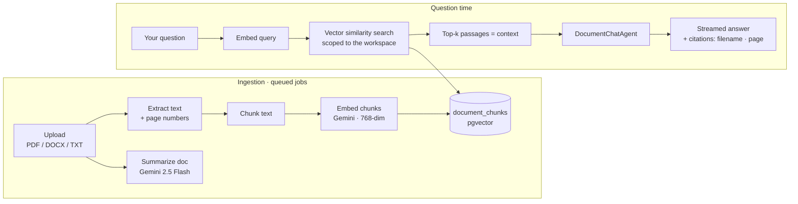

# Multi-Doc RAG

> **Upload your documents, ask anything — every answer is grounded in *your* sources, with citations.**

A Retrieval-Augmented Generation (RAG) web app. Create a workspace, upload your
PDF / DOCX / TXT files, and chat across all of them. Every answer is built only
from the content you uploaded, and each one cites exactly where it came from
(filename + page number). This is **not** a general chatbot — if the answer
isn't in your documents, the assistant says so instead of making something up.

<p>
  
  
  
  
  
  
</p>

---

## ✨ Features

- **Multi-document workspaces** — group documents per project or topic; each workspace has its own files and chat.
- **Upload PDF, DOCX, and TXT** — up to 20 MB per file, multiple files at once.
- **Grounded answers with citations** — every response references the source filename and page number; nothing is invented.
- **Streaming chat** — answers stream token-by-token for a responsive feel.
- **Automatic summaries** — each document gets a short AI summary as soon as it's processed.
- **Suggested questions** — starter questions are generated from your documents so you know what to ask.
- **Public read-only sharing** — publish a workspace behind a private share link; anyone with the link can view it, no sign-in required.
- **Insightful dashboard** — at-a-glance stats (workspaces, documents, indexed passages, questions asked) plus your most recent workspaces and documents.
- **Resilient by design** — heavy parsing/embedding runs in background jobs with retries, optional embedding cache, and optional text-model failover.

---

## 🧠 How it works

The app pairs a vector database (PostgreSQL + `pgvector`) with the
[Laravel AI SDK](https://github.com/laravel/ai) and Google Gemini.



1. **Ingestion** — on upload, a `ParseAndEmbedDocument` job extracts text (tracking page numbers), splits it into overlapping chunks, generates embeddings, and stores them as `pgvector` rows scoped to the workspace. A follow-up job writes a short summary.
2. **Retrieval** — when you ask a question, it's embedded and compared against the workspace's chunks using native cosine similarity (`whereVectorSimilarTo`). Only the most relevant passages are passed to the model.
3. **Answer** — the `DocumentChatAgent` answers **only** from those passages and streams the response, attaching citations derived from the exact chunks it used.

---

## 🛠 Tech stack

| Layer | Technology |
| --- | --- |
| Language / framework | PHP 8.4, Laravel 13 |
| Frontend | Livewire 4, Flux UI (free), Tailwind CSS 4 |
| AI | Laravel AI SDK (`laravel/ai`) + Google Gemini — `gemini-2.5-flash` (text), `gemini-embedding-001` @ 768 dims (embeddings) |
| Vector store | PostgreSQL + `pgvector` (Docker locally; any managed Postgres with pgvector in prod) |
| Parsing | `smalot/pdfparser` (PDF), `phpoffice/phpword` (DOCX), with optional Gemini Files API fallback |
| Background work | Laravel Queue (`database` driver) |
| Auth | Laravel Fortify (Livewire starter kit) |
| Tests | Pest v4 |

---

## ✅ Prerequisites

- **PHP 8.3+** with the `pdo_pgsql` extension (plus the usual Laravel extensions)
- **Composer 2**
- **Node.js 18+** and npm
- **[Docker Desktop](https://www.docker.com/products/docker-desktop/)** — runs the
  PostgreSQL + `pgvector` database from the bundled `compose.yaml` (the migration
  enables the extension for you). No local Postgres install needed.
- A **Google Gemini API key** — get a free one at
  [Google AI Studio](https://aistudio.google.com/app/apikey).

---

## 🚀 Installation

```bash
# 1. Clone
git clone https://github.com/FabianOkky/multi-doc-rag.git
cd multi-doc-rag

# 2. Environment — copy the template, then add your Gemini key
cp .env.example .env
#   edit .env  ->  GEMINI_API_KEY=...   (the DB defaults already match compose.yaml)

# 3. Start the database (PostgreSQL + pgvector)
docker compose up -d

# 4. Install deps, generate the app key, migrate, and build the frontend
composer run setup
```

`composer run setup` runs `composer install`, copies `.env` if missing,
`php artisan key:generate`, `php artisan migrate` (creates the tables, enables the
`vector` extension, and builds the HNSW index), then `npm install && npm run build`.

> 💡 **Port already in use?** If something already listens on `5432`, set
> `DB_PORT=5433` in `.env` and re-run `docker compose up -d` (Compose maps the host
> port from `DB_PORT`; the container always listens on 5432).

---

## 🔧 Configuration

Set these in your `.env` (the full template is in `.env.example`):

### Database — PostgreSQL + pgvector (Docker)

The bundled `compose.yaml` runs a `pgvector` image locally, and the defaults in
`.env.example` already match it — `docker compose up -d` is all you need:

```dotenv
DB_CONNECTION=pgsql
DB_HOST=127.0.0.1
DB_PORT=5432        # set 5433 if 5432 is already taken
DB_DATABASE=multi_doc_rag
DB_USERNAME=postgres
DB_PASSWORD=secret
DB_SSLMODE=prefer
DB_SEARCH_PATH=public
```

For a hosted database (production/demo), point `DB_*` at any managed Postgres that
supports `pgvector` (e.g. [Neon](https://neon.tech), [Railway](https://railway.app))
and set `DB_SSLMODE=require`.

### AI — Google Gemini

```dotenv
GEMINI_API_KEY=<your-gemini-api-key>

AI_TEXT_MODEL=gemini-2.5-flash
AI_EMBEDDINGS_MODEL=gemini-embedding-001
AI_EMBEDDINGS_DIMENSIONS=768   # must match the vector() column in the migration
```

### RAG tuning (optional)

```dotenv
RAG_CHUNK_SIZE=1000
RAG_CHUNK_OVERLAP=150
RAG_RETRIEVE_LIMIT=5
RAG_MIN_SIMILARITY=0.4
RAG_PARSER_PRIMARY=local       # "local" or "gemini"
```

> ⚠️ **Keep your secrets out of git.** `.env` (and `.env.testing`,
> `.env.production`) are git-ignored. Only the secret-free `.env.example`
> template is committed.

---

## ▶️ Running locally

The app does real work in the background (parsing + embedding + summarizing), so
you need a queue worker running alongside the web server.

```bash
composer run dev
```

This runs the web server, the **queue worker**, and Vite together. Then open the
URL it prints (default `http://localhost:8000`), register an account, and start a
workspace.

Prefer separate terminals? Run them yourself:

```bash
php artisan serve
php artisan queue:work
npm run dev
```

---

## 📖 Usage

1. **Register / log in.**
2. **Create a workspace** from the dashboard or the Workspaces page.
3. **Upload documents** (PDF / DOCX / TXT). They show a "Processing" badge while
   the background jobs parse, embed, and summarize them, then flip to "Ready".
4. **Ask questions** in the chat. Tap a suggested question or type your own — the
   answer streams in with citations to the source filename and page.
5. **Share (optional)** — flip the share switch to publish a read-only link.

The assistant answers in the language of your question and refuses to answer
anything that isn't supported by your documents.

---

## 🧪 Testing

The suite runs against PostgreSQL + pgvector in an isolated schema, so AI calls
are faked — no API quota is used and no Gemini key is required for tests.

`.env.testing` points at the same Docker database with `DB_SEARCH_PATH=testing`, so
the suite (RefreshDatabase) only ever touches the isolated `testing` schema — never
your development data. With the container running (`docker compose up -d`):

```bash
php artisan test --compact      # or: composer test  (also runs Pint)
```

---

## ☁️ Deployment

The repo includes a `Procfile` for platforms like **Railway** or **Render**:

```
web:    php artisan migrate --force && php artisan config:cache && php artisan serve --host=0.0.0.0 --port=$PORT
worker: php artisan queue:work --tries=3 --max-time=3600 --sleep=3 --backoff=10
```

Run **both** a `web` and a `worker` process. In production set:

- `APP_ENV=production`, `APP_DEBUG=false`, and a fresh `APP_KEY`
- a managed Postgres with `pgvector` in `DB_*` (`DB_SSLMODE=require`)
- `GEMINI_API_KEY`
- `QUEUE_CONNECTION=database`

---

## 📂 Project structure

```
app/
├── Agents/        # AI agents: DocumentChatAgent, SummaryAgent, SuggestionAgent
├── Jobs/          # ParseAndEmbedDocument, GenerateSummary (queued)
├── Livewire/      # Dashboard, Workspace, Chat, Shared components
├── Models/        # Workspace, Document, DocumentChunk, ChatSession, ChatMessage
└── Services/      # Chunker, DocumentParser, Retriever, Suggester
resources/views/   # Blade + Livewire templates (Flux UI)
routes/web.php     # Routes (auth-gated app + public share link)
tests/             # Pest feature & unit tests
```

---

## 📜 License

Released under the [MIT License](LICENSE).

## 👤 Author

**Fabian Okky** — built as a portfolio project to demonstrate a production-style
RAG pipeline with Laravel, Livewire, and pgvector.
