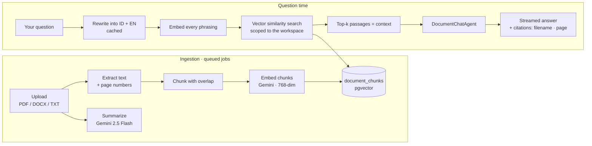

# Multi-Doc RAG

> **Upload your documents, ask anything — every answer is grounded in *your* sources, with citations.**

A Retrieval-Augmented Generation web app. Create a workspace, upload your
PDF / DOCX / TXT files, and chat across all of them. Every answer is built only
from the content you uploaded, and each one cites exactly where it came from
(filename + page number).

This is **not** a general chatbot. Ask it who the president of France is and it
will tell you your documents don't cover that — which is the point.

<p>
  
  
  
  
  
  
  
</p>

---

## ✨ Features

- **Multi-document workspaces** — group documents per project or topic; each workspace has its own files and chat.
- **Upload PDF, DOCX, and TXT** — up to 10 files at a time, 20 MB each.
- **Grounded answers with citations** — every response names the source filename and page. Sources are *derived* from the retrieved passages, never written by the model.
- **Cross-language search** — ask in Indonesian, find the answer in an English document, and vice versa. Documents are never translated, so citations always point at your original text.
- **Choose your reply language** — auto (mirror the question), Bahasa Indonesia, or English.
- **Streaming chat** — answers arrive token by token.
- **Automatic summaries** — each document gets a short factual summary as soon as it is processed.
- **Suggested questions** — starter questions generated from your documents, so you know what to ask.
- **Public read-only sharing** — publish a workspace behind a private link; no sign-in needed to view it, and disabling the link 404s it instantly.
- **Insightful dashboard** — workspaces, documents, indexed passages and questions asked, plus your most recent activity.
- **Built to degrade, not break** — queued jobs with retries, an embedding cache, a parser fallback, and an optional second text provider for when a free-tier quota runs out.

---

## 🧠 How it works

The app pairs a vector database (PostgreSQL + `pgvector`) with the
[Laravel AI SDK](https://github.com/laravel/ai) and Google Gemini.



1. **Ingestion** — a queued `ParseAndEmbedDocument` job extracts text page by page, splits it into overlapping chunks, embeds them in batches, and stores them as `pgvector` rows scoped to the workspace. A follow-up job writes the summary.
2. **Retrieval** — your question is rewritten into Indonesian and English, every phrasing is embedded and searched with native cosine similarity (`whereVectorSimilarTo`), and the hits are merged by best distance. Passages below the relevance floor are dropped, which is what makes "I don't know" a reachable answer.
3. **Answer** — `DocumentChatAgent` answers only from those passages and streams the reply. Afterwards, only the sources the answer actually named are kept as citations.

---

## 🧩 Engineering notes

A few decisions that shaped the codebase, and why:

- **Citations are derived, not generated.** The model writes prose; the app matches that prose against the chunks it retrieved and keeps only the sources the answer named. A model cannot fabricate a citation, because it never writes the citation list.
- **Retrieval is scoped in SQL.** `where('workspace_id', …)` is a plain predicate on the table being searched — not a filter applied afterwards — so another user's document can never become your evidence. Tests assert this directly.
- **No structured output on the chat hot path.** The OpenAI-compatible failover providers reject `json_schema` outright, so a merely rate-limited Gemini would become a hard 400. The query-translation agent returns three labelled lines that every model can produce.
- **The reply-language rule is repeated on the user's turn.** Replayed conversation history out-weighs any system prompt — after a few Indonesian turns, an English question comes back in Indonesian unless the requirement is restated immediately before the model answers.
- **Embeddings never fail over.** Text generation advances down a provider chain on a 429; embeddings must not, because vectors from a different model live in a different space and would silently corrupt retrieval.
- **Tests run on real PostgreSQL + pgvector, never SQLite** — swapping the database would mean testing a different program. AI calls are faked, so the suite is offline and free, but the vector search is genuine.

---

## 🛠 Tech stack

| Layer | Technology |
| --- | --- |
| Language / framework | PHP 8.4, Laravel 13 |
| Frontend | Livewire 4, Flux UI (free), Tailwind CSS 4 |
| AI | Laravel AI SDK (`laravel/ai`) + Google Gemini — `gemini-2.5-flash` (text), `gemini-embedding-001` @ 768 dims (embeddings) |
| Vector store | PostgreSQL + `pgvector` (HNSW index, cosine distance) |
| Parsing | `smalot/pdfparser` (PDF), `phpoffice/phpword` (DOCX), with a Gemini Files API fallback |
| Background work | Laravel Queue (`database` driver) |
| Auth | Laravel Fortify |
| Tests | Pest 4 |

---

## 🚀 Quick start

**Prerequisites:** PHP 8.3+ with `pdo_pgsql`, Composer 2, Node 18+, Docker
Desktop, and a [free Gemini API key](https://aistudio.google.com/app/apikey).

```bash
# 1. Clone and configure
git clone https://github.com/FabianOkky/multi-doc-rag.git
cd multi-doc-rag
cp .env.example .env
#   edit .env  ->  GEMINI_API_KEY=...   (the DB defaults already match compose.yaml)

# 2. Start PostgreSQL + pgvector
docker compose up -d

# 3. Install, migrate, build
composer run setup

# 4. Optional: a local account to sign in with
php artisan db:seed          # Fabian Okky / fabian@example.com / password

# 5. Run it (web + queue worker + Vite)
composer run dev
```

Then open the printed URL, create a workspace, and upload something.

> **A queue worker is not optional.** Parsing, embedding and summarizing all run
> in queued jobs — without a worker, uploads sit at "Processing" forever.
> `composer run dev` starts one for you.

> **Port 5432 already taken?** Set `DB_PORT=5433` in `.env` and re-run
> `docker compose up -d`.

Full walkthrough: [docs/getting-started.md](docs/getting-started.md).

---

## 📚 Documentation

Everything lives in [`docs/`](docs/README.md).

| Document | What it covers |
| --- | --- |
| [Getting started](docs/getting-started.md) | Prerequisites through to your first answer |
| [Architecture](docs/architecture.md) | How the pieces fit, the agents, the resilience and security model |
| [RAG pipeline](docs/rag-pipeline.md) | Parsing, chunking, embedding, retrieval and how citations are derived |
| [Bilingual retrieval](docs/bilingual-retrieval.md) | Cross-language search and the reply-language control |
| [Configuration](docs/configuration.md) | Every environment variable, and what moving it does |
| [Data model](docs/data-model.md) | Schema, relationships, indexes, the vector column |
| [Testing](docs/testing.md) | Running the suite, database isolation, helpers, coverage |
| [Manual test plan](docs/manual-test-plan.md) | A scripted pass for what a test suite can't check |
| [Deployment](docs/deployment.md) | Railway / Render, the Procfile, cost control on a free tier |
| [Troubleshooting](docs/troubleshooting.md) | Common failure modes and their causes |

---

## 🧪 Tests

```bash
php artisan test --compact      # or: composer test  (also runs Pint)
```

**127 passed, 1 skipped, 954 assertions.**

The suite runs against real PostgreSQL + pgvector inside an isolated `testing`
schema, so it never touches your development data, and every AI call is faked —
no API key needed and no quota spent. See [docs/testing.md](docs/testing.md).

---

## ☁️ Deployment

A `Procfile` is included for Railway, Render and similar platforms. Run **both**
the `web` and `worker` processes, point `DB_*` at a managed Postgres with
`pgvector` (`DB_SSLMODE=require`), and set `APP_ENV=production`, `APP_DEBUG=false`,
a fresh `APP_KEY` and `GEMINI_API_KEY`.

Details, including cost control on a free tier:
[docs/deployment.md](docs/deployment.md).

---

## 📂 Project structure

```
app/
├── Actions/       DeleteWorkspace
├── Agents/        DocumentChatAgent, SummaryAgent, SuggestionAgent, QueryTranslationAgent
├── Jobs/          ParseAndEmbedDocument, GenerateSummary (queued)
├── Livewire/      Dashboard, Workspace, Chat, Shared, Settings
├── Models/        Workspace, Document, DocumentChunk, ChatSession, ChatMessage
├── Policies/      WorkspacePolicy
└── Services/      Chunker, DocumentParser, Retriever, QueryTranslator, Suggester, …
config/rag.php     Every RAG tunable, documented inline
database/          Migrations, factories, seeder
docs/              Full documentation
resources/views/   Blade + Livewire templates (Flux UI)
routes/web.php     Auth-gated app + the public share link
tests/             Pest feature & unit tests
```

---

## 📜 License

Released under the [MIT License](LICENSE).

## 👤 Author

**Fabian Okky** — built as a portfolio project to demonstrate a production-style
RAG pipeline with Laravel, Livewire and pgvector.
