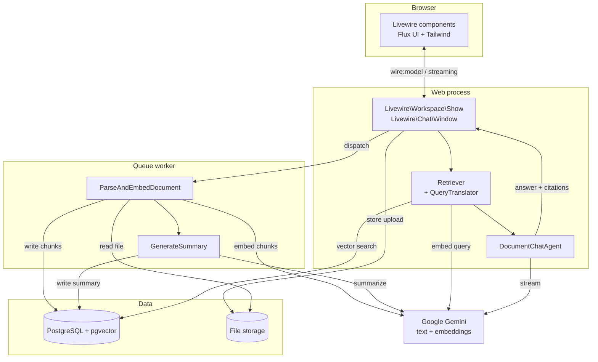

# Architecture

Multi-Doc RAG is a single Laravel application with two long-running pieces: the
web process (Livewire over HTTP) and a queue worker. Everything expensive —
parsing, embedding, summarizing — happens in the worker, so an upload returns
immediately and the page reports progress.

---

## System shape

---

## The two flows

### Ingestion — upload to searchable

`Livewire\Workspace\Show::save()` validates the files, stores each one on the
configured disk, creates a `Document` row with status `processing`, and
dispatches `ParseAndEmbedDocument`. Nothing else happens in the request.

In the worker:

1. **`DocumentParser`** extracts text one entry per page. PDFs go through
   `smalot/pdfparser`, DOCX through `phpoffice/phpword` (splitting on explicit
   page breaks), TXT is read as a single page. If the primary extractor returns
   almost nothing — a scanned PDF, for instance — it falls back to handing the
   raw file to Gemini's Files API. Page numbers are not recoverable there, so
   those chunks carry `page_number = null`.
2. **`Chunker`** slices each page into overlapping, word-aligned chunks.
3. The chunk texts are embedded in batches of 100 and written to
   `document_chunks`, replacing any previous chunks for that document inside a
   transaction — so a retry is idempotent rather than additive.
4. **`GenerateSummary`** is dispatched. It writes a 3–4 sentence summary and
   flips the document to `ready` in a single update.

The document stays `processing` until the summary job finishes, so the card's
loading state covers embedding *and* summarizing rather than flickering to
"Ready" halfway through.

### Question — question to cited answer

`Livewire\Chat\Window::sendMessage()` validates and rate-limits the question,
persists it as a `ChatMessage`, and dispatches a browser event. The follow-up
request runs `streamAnswer()`:

1. **`QueryTranslator`** rewrites the question into Indonesian and English (one
   small, cached prompt). See [Bilingual retrieval](bilingual-retrieval.md).
2. **`Retriever`** embeds every phrasing in one batch call, runs one vector
   search per phrasing scoped to the workspace, and merges the hits keeping each
   chunk's best cosine distance.
3. The surviving chunks become a labelled context block and a list of candidate
   citations (`RetrievalResult`).
4. **`DocumentChatAgent`** is constructed with that context, the recent
   conversation history and the workspace's answer language, and streamed to the
   browser delta by delta.
5. Once the answer is complete, `RetrievalResult::citationsUsedBy()` keeps only
   the sources the answer actually names. Those are saved on the assistant
   message as JSON.

---

## Components

### Agents (`app/Agents`)

Each agent is a PHP class implementing `Laravel\Ai\Contracts\Agent`. The
instructions are written in English regardless of the reply language — the models
this app targets follow English system prompts more reliably, and the output
language is a separate, explicit decision.

| Agent | Responsibility | Notes |
| --- | --- | --- |
| `DocumentChatAgent` | Answers from the retrieved context only | Also `Conversational`: replays recent history. Streams. |
| `SummaryAgent` | 3–4 factual sentences per document | Exactly one prompt per document. |
| `SuggestionAgent` | 3–5 starter questions from the summaries | Uses structured output. One prompt per set of summaries. |
| `QueryTranslationAgent` | Rewrites a question into ID + EN | Returns three labelled lines, *not* structured output. |

Two of those choices were learned the hard way and are load-bearing:

- **No structured output on the chat hot path.** The OpenAI-compatible failover
  providers (Groq's Llama models, for instance) reject `json_schema` requests
  outright. If `QueryTranslationAgent` asked for structured output, a merely
  rate-limited Gemini would turn into a hard `400` instead of a working answer.
  Three labelled lines are something every model can produce.
- **A forced answer language has to be repeated on the user's turn.** The
  replayed conversation history pulls hard toward the language it was written in
  and out-weighs any system-prompt wording. `DocumentChatAgent::turn()` appends a
  one-line reminder to what is sent to the model; the stored `ChatMessage` keeps
  the user's own words.

### Services (`app/Services`)

| Service | Responsibility |
| --- | --- |
| `Chunker` | Overlapping, word-aligned text chunks |
| `DocumentParser` | Page-aware text extraction with a fallback extractor |
| `Retriever` | Scoped vector search, context assembly, candidate citations |
| `QueryTranslator` | Cross-lingual query rewriting, cached |
| `Suggester` | Starter questions, cached per set of summaries |
| `AnswerLanguage` | The enum behind the reply-language picker |
| `RetrievalResult` | The retrieval outcome, and the citation filter |
| `TranslatedQuery` | A question plus the phrasings to search for it |

### Livewire components (`app/Livewire`)

| Component | Route | Purpose |
| --- | --- | --- |
| `Dashboard` | `/dashboard` | Stats, recent workspaces and documents |
| `Workspace\Index` | `/workspaces` | Create, rename, delete workspaces |
| `Workspace\Show` | `/workspaces/{workspace}` | Upload, retry, delete documents; share toggle; hosts the chat |
| `Chat\Window` | — | The conversation itself |
| `Shared\Show` | `/s/{token}` | Public, read-only view of a shared workspace |
| `Settings\*` | `/settings/*` | Profile, appearance, security |

---

## Resilience

The app is built to degrade rather than break, because it targets free provider
tiers where a rate limit is routine.

| Failure | What happens |
| --- | --- |
| Local text extraction yields nothing | Falls back to Gemini's Files API (and vice versa) |
| Gemini is rate limited (429), out of credit (402) or overloaded (503) | Text generation advances down `config('rag.text_failover')` |
| The chat provider fails completely | The question is still saved; a plain "temporarily unavailable" message is stored in the question's language, with no citations |
| The suggestion prompt fails | The chips disappear for that visit; the failure is **not** cached, so the next visit retries |
| The translation prompt fails | Retrieval falls back to searching the user's own wording |
| `ParseAndEmbedDocument` dies | The document is marked `failed` and the card offers a Retry button |
| `GenerateSummary` dies | The document still becomes `ready` — its chunks are embedded and queryable without a summary |

Embeddings are deliberately excluded from the failover chain. Vectors from a
different model live in a different space and dimension, and mixing them would
silently corrupt cosine retrieval against the stored 768-dimension vectors.
Embeddings rely on caching and job retries instead.

---

## Security model

- Every workspace action authorizes through `WorkspacePolicy`, and authorization
  is re-checked inside each Livewire action rather than only on mount — a spoofed
  component payload cannot reach another user's data.
- `deleteDocument()` and `retryDocument()` re-fetch the document *scoped to the
  workspace*, so a forged id returns 404 instead of touching someone else's file.
- Retrieval is filtered by `workspace_id` in SQL. Cross-workspace leakage is
  covered by tests in both `ChatRetrievalTest` and `ChatMessageCitationTest`.
- Share tokens are 40 random characters, unique per workspace. Disabling sharing
  keeps the token (so re-enabling restores the same link) but makes the public
  route 404. `public/robots.txt` disallows `/s/`.
- Uploads are validated three ways: extension, declared MIME type, and a check
  that the detected contents match the extension — a PDF renamed to `.txt` is
  rejected.
- Chat is rate limited to 10 questions per minute per user per workspace, and the
  pending question is a `#[Locked]` property the browser cannot change.
- `pendingQuestion` guards against double submission; a second send while an
  answer is streaming is refused with a validation error.

---

## Further reading

- [RAG pipeline](rag-pipeline.md) — chunking, embedding and citation details
- [Data model](data-model.md) — tables, relationships and indexes
- [Configuration](configuration.md) — every knob, and what moving it does
