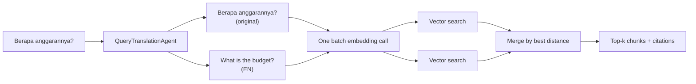

# Bilingual retrieval

Two separate things are often confused, so this document keeps them apart:

| | What it controls | Toggle |
| --- | --- | --- |
| **Cross-lingual retrieval** | Whether an Indonesian question can *find* an English passage | `RAG_MULTILINGUAL_QUERY` |
| **Answer language** | Which language the reply is *written in* | The picker in the chat header, stored on the workspace |

Documents are never translated. They are stored, searched and cited in their
original language, so every citation still points at the user's own text.

---

## The problem

Embedding models are only weakly cross-lingual. Ask *"Berapa anggarannya?"*
against a corpus that says *"The proposed budget for the next fiscal year is 4.2
million"*, and the cosine similarity between the Indonesian question vector and
the English passage vector is frequently below any useful threshold. The passage
answers the question perfectly and retrieval returns nothing.

The obvious fixes are both bad:

- **Translate the documents at ingest.** Now citations point at machine
  translations rather than the user's own words, and the app quietly stops being
  evidence-based.
- **Lower the similarity threshold.** That surfaces genuinely irrelevant chunks
  in every language, and "I don't know" stops being reachable.

---

## The fix: translate the query, not the corpus



1. **`QueryTranslationAgent`** receives the question and replies with exactly
   three labelled lines:

   ```
   LANG: id
   ID: Berapa anggarannya?
   EN: What is the budget?
   ```

2. **`TranslatedQuery`** collects the phrasings to search, always starting with
   the user's own wording, dropping blanks and case-insensitive duplicates. A
   question already in English yields two identical variants and is searched
   once.

3. **`Retriever`** embeds every variant in a **single batch call**, searches once
   per vector, and merges the hits keeping each chunk's smallest distance. The
   best match wins regardless of which language found it.

The extra cost is one small prompt per *distinct* question, and results are
cached for seven days keyed by a hash of the lowercased question. Asking the same
thing twice, or clicking the same suggestion chip twice, is free.

### Why three lines instead of structured output

`QueryTranslationAgent` sits on the chat hot path, so it must survive the entire
text failover chain. The OpenAI-compatible fallback providers — Groq's Llama
models, for example — reject `json_schema` requests outright. If this agent asked
for structured output, a merely rate-limited Gemini would become a hard `400` and
take the whole answer down with it.

Three labelled lines are something every model can produce. The parser is
correspondingly forgiving: it scans for `LANG:`, `ID:` and `EN:` with a
case-insensitive regex, trims stray quotes, and ignores anything else the model
volunteered.

### Failure is always survivable

Every failure path degrades to searching the user's own wording:

| Situation | Result |
| --- | --- |
| `RAG_MULTILINGUAL_QUERY=false` | Monolingual search; the agent is never prompted |
| Question longer than 2000 characters | Monolingual search (matches the chat input limit) |
| Provider unavailable, or the response cannot be parsed | Monolingual search; the failure is reported, not cached |
| Only one of `ID:` / `EN:` came back | Monolingual search — half a translation gains nothing over the original |

A slightly worse retrieval result is always better than a broken chat.

---

## Answer language

`workspaces.answer_language` stores one of three values, modelled by the
`App\Services\AnswerLanguage` enum:

| Value | Label | Behaviour |
| --- | --- | --- |
| `auto` | *Match my question* | The model mirrors the language of the question |
| `id` | *Bahasa Indonesia* | Always Indonesian, whatever the question and passages are |
| `en` | *English* | Always English, whatever the question and passages are |

The setting is persisted on the workspace, not on the browser tab, so it also
governs future document summaries and suggested questions. A workspace set to
English reads consistently even when its documents are Indonesian.

The explicit options exist because smaller and cheaper models — exactly the ones
this app falls back to — write noticeably better English than Indonesian. Being
able to ask in Indonesian and read a good English answer is a real preference.

### Why the language directive is repeated

A forced language is enforced in **two** places:

1. At the very end of the system instructions, *after* the retrieved context.
2. Appended to the user's turn, in `DocumentChatAgent::turn()`.

The second one is not redundant. `DocumentChatAgent` is `Conversational`, so
earlier turns are replayed to the model — and after a few Indonesian exchanges
the model keeps answering in Indonesian no matter how the system prompt is
worded. The history out-weighs it. A one-line reminder immediately before the
question is what actually wins.

The reminder is added only to what is sent to the model. The stored `ChatMessage`
keeps the user's own wording, so the transcript stays clean.

Position matters in the system prompt too: the language rule comes last, after
the context block. Buried above a wall of retrieved text, it loses.

### When the provider is down

`AnswerLanguage::unavailableMessage()` produces the "temporarily unavailable"
message without any AI call — which is the whole point, since the provider is the
thing that failed.

Under `auto` it has to guess a language with no model available, so it runs a
small deterministic check: tokenize the question, count matches against short
Indonesian and English function-word lists, and take the higher score. On a tie
it falls back to the application locale. Crude, but it only has to pick which of
two fixed sentences to show, and it never fails.

---

## Cost

| Operation | Frequency | Cached |
| --- | --- | --- |
| Query translation | Once per distinct question | Yes — 7 days |
| Query embedding | Once per distinct phrasing | Yes — `AI_EMBEDDINGS_CACHE` |
| Chat completion | Every question | No |
| Document summary | Once per document | n/a — persisted |
| Starter questions | Once per set of summaries | Yes — 1 day |

If your corpus and your users only ever speak one language, set
`RAG_MULTILINGUAL_QUERY=false` and save a prompt per distinct question. Nothing
else changes.

---

## In the test suite

Cross-lingual retrieval is **off** for the suite as a whole (`phpunit.xml`), so no
test can accidentally reach a provider it has not faked.
`tests/Feature/BilingualRetrievalTest.php` turns it back on explicitly in a
`beforeEach`, with `QueryTranslationAgent::fake()` in place, and covers:

- an Indonesian question retrieving an English passage it would otherwise miss
- hits from different phrasings merged and ranked by best distance
- a translated question prompted for once, then served from cache
- falling back to the user's own wording when translation fails
- the agent never being prompted when the feature is disabled
- the answer language persisting to the workspace and reaching the agent
