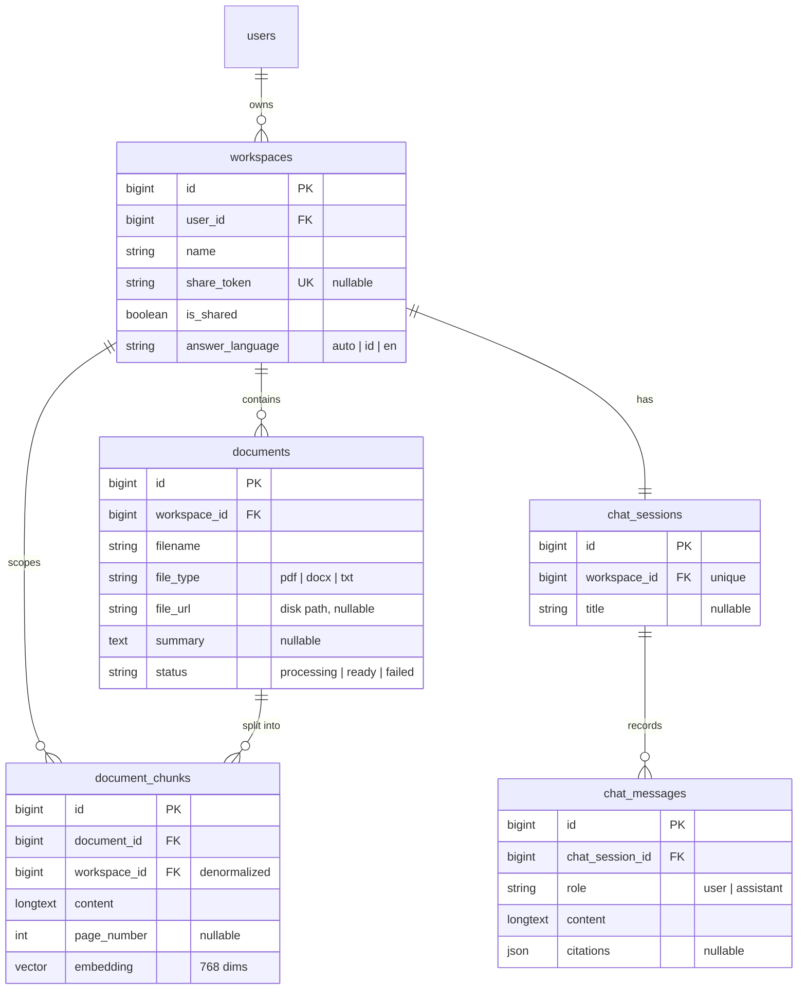

# Data model

Five tables carry the application, plus Laravel's own `users`, `cache`, `jobs`
and `sessions`. Everything lives in PostgreSQL; `document_chunks.embedding` is a
`pgvector` column.

---

## Entity relationships



Every foreign key cascades on delete, so removing a workspace removes its
documents, chunks, session and messages in one statement. Stored files are not
covered by a database cascade, so `App\Actions\DeleteWorkspace` collects the file
paths first, deletes the workspace, then deletes the files from disk.

---

## Tables

### `workspaces`

| Column | Type | Notes |
| --- | --- | --- |
| `user_id` | FK → users | Cascade delete |
| `name` | string | Required, max 255 |
| `share_token` | string, unique, nullable | 40 random characters, generated on first share |
| `is_shared` | boolean, default false | Whether the public link currently resolves |
| `answer_language` | string, default `auto` | Cast to `App\Services\AnswerLanguage` |

Disabling sharing sets `is_shared = false` but **keeps** the token, so
re-enabling later restores the same URL. The public route matches on both
columns, so a disabled link 404s.

### `documents`

| Column | Type | Notes |
| --- | --- | --- |
| `workspace_id` | FK → workspaces | Cascade delete |
| `filename` | string | The user's own filename, sanitised and truncated to fit |
| `file_type` | string(10) | `pdf`, `docx` or `txt` |
| `file_url` | string, nullable | Path on the configured disk |
| `summary` | text, nullable | 3–4 sentences, written by `SummaryAgent` |
| `status` | string, default `processing` | `processing` → `ready` or `failed` |

`status` is the contract between the jobs and the UI. It stays `processing` until
`GenerateSummary` finishes, so the card's loading state covers embedding *and*
summarizing. Only `ready` documents are searched, which keeps a half-processed or
failed document from being quoted as evidence.

### `document_chunks`

| Column | Type | Notes |
| --- | --- | --- |
| `document_id` | FK → documents | Cascade delete |
| `workspace_id` | FK → workspaces | **Denormalized on purpose** |
| `content` | longtext | The chunk text, as it will appear in the context block |
| `page_number` | unsigned int, nullable | The citation. Null when the extractor could not recover pages |
| `embedding` | `vector(768)` | Cast to `array`; Eloquent encodes/decodes the pgvector text format |

`workspace_id` is duplicated here so retrieval can scope with a single plain
`where` clause rather than joining through `documents`. The isolation boundary is
the most security-sensitive predicate in the app, and this keeps it a column
comparison on the table being searched.

### `chat_sessions`

One session per workspace — `workspace_id` carries a **unique** index, and the
chat component uses `firstOrCreate`. The table exists as its own entity so
multiple named conversations per workspace remain possible later without a
migration of the message table.

### `chat_messages`

| Column | Type | Notes |
| --- | --- | --- |
| `chat_session_id` | FK → chat_sessions | Cascade delete |
| `role` | string(20) | `user` or `assistant` |
| `content` | longtext | The message as displayed |
| `citations` | json, nullable | `[{document_id, filename, page_number}]` |

`citations` is denormalized into the message rather than modelled as a join
table, because a citation is a snapshot of what grounded *that* answer. If a
document is later deleted or re-embedded, the answer's displayed sources should
still say what they said when the answer was written.

---

## Indexes

| Index | Table | Purpose |
| --- | --- | --- |
| HNSW on `embedding` (`vector_cosine_ops`) | `document_chunks` | Approximate nearest-neighbour search. A plain B-tree index is rejected by pgvector. |
| `(workspace_id)` | `document_chunks` | The scoping predicate on every search |
| `(document_id)` | `document_chunks` | Deleting and replacing a document's chunks |
| `(user_id, created_at)` | `workspaces` | The workspace list and dashboard, newest first |
| `(workspace_id, status)` | `documents` | Ready-document filtering during retrieval |
| `(workspace_id, created_at)` | `documents` | The document list, newest first |
| unique `(workspace_id)` | `chat_sessions` | Enforces one session per workspace |
| `(chat_session_id, id)` | `chat_messages` | Reading a transcript in order |

---

## The vector column

```php
$table->vector('embedding', dimensions: 768);
$table->vectorIndex('embedding');
```

768 is the output width requested from `gemini-embedding-001`, and it is fixed in
three places that must always agree — `config/ai.php`, this migration, and
`config/rag.php`. See [Configuration](configuration.md).

The migration begins with `Schema::ensureVectorExtensionExists()`, which issues
`CREATE EXTENSION IF NOT EXISTS vector`. The bundled Docker image ships the
extension pre-built, and most managed Postgres providers offer it as a toggle.

---

## Factories

Every model has a factory, and the ones with meaningful states expose them:

```php
Workspace::factory()->for($user)->create();
Document::factory()->for($workspace)->ready()->create(['filename' => 'report.pdf']);
Document::factory()->for($workspace)->failed()->create();
DocumentChunk::factory()->forDocument($document)->create([
    'embedding' => unitVector(0),
    'page_number' => 3,
]);
```

`unitVector($i)` is a test helper that builds a 768-dimension vector of zeros
with a single `1.0` at index `$i`. Two such vectors at different indexes are
orthogonal — cosine similarity exactly 0 — and a vector matched against itself
scores exactly 1.0. That makes pgvector similarity assertions deterministic
without ever calling the embeddings API. See [Testing](testing.md).
